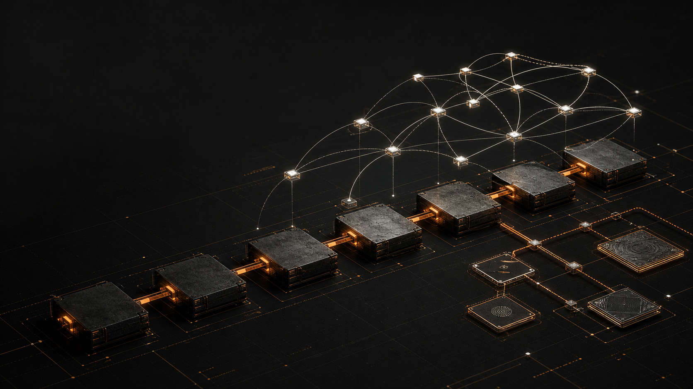

# 06 — Bitcoin tooling landscape

- Route: `#/tools/bitcoin`
- Related chain hub: `#/c/bitcoin`
- Evidence snapshot: 2026-08-29

## Landscape thesis

Bitcoin’s useful tooling landscape is not a smaller Ethereum. Its native center is node/wallet software, UTXO construction, fee estimation, mining, payment processing, and verifiable exploration. Lightning adds a separate channel-liquidity and instant-payment plane; Ordinals and Runes add asset/market tooling; bridges, staking, credit, and cross-chain swaps are adjacent systems with additional trust assumptions.

The visual depicts deliberate base settlement, a separate Lightning channel mesh, and a side cluster for inscriptions. These are conceptual layers, not a live topology.

## Category coverage

| Category | Coverage | Editorial note |
|---|---|---|
| Launch and issuance | app-layer | Ordinals/Runes launch tooling exists; no generic native smart-contract launchpad |
| Spot DEX and liquidity | adjacent | peer-to-peer and atomic/cross-chain markets exist; no base-layer AMM |
| Aggregation, routing, and intents | adjacent | Lightning routing and cross-chain intent systems solve different jobs |
| Derivatives and prediction | native gap | DLC primitives exist, but no qualifying broad native production venue in this snapshot |
| Lending, borrowing, and stablecoins | adjacent | BTC-collateral products execute through additional protocols or services |
| Yield, vaults, and strategy | adjacent | routing fees and external BTC products; no protocol-native yield primitive |
| Staking, restaking, and validation | native gap | Bitcoin uses proof of work; “BTC staking” is an adjacent script/protocol construction |
| Pricing, oracles, and market data | established service | strong fee, market, and network data; no base-layer oracle contract system |
| Analytics, indexing, and exploration | dense | strong open-source node, mempool, explorer, and UTXO analytics |
| Charting, portfolio, and discovery | established | mature market/network analytics and inscription discovery |
| Wallets, accounts, and custody | dense | full-node, SPV, hardware, multisig, Lightning, and inscription-specialized wallets |
| Bridges and interoperability | adjacent | federated, threshold, smart-contract, and sidechain models must be distinguished |
| MEV, order flow, and execution | established | mempool/fee policy and Lightning liquidity are the relevant execution planes |
| Security, risk, and compliance | established | strong self-verification, descriptor, payment-server, and analytics tooling |
| SocialFi, identity, and consumer | established app-layer | Nostr zaps and Lightning commerce are app protocols, not Bitcoin L1 state |
| Developer infrastructure | dense | mature node, RPC, signing, wallet, and Lightning libraries |
| Collectibles and marketplaces | established app-layer | Ordinals/Runes ecosystem with dedicated wallets and markets |

## Normalized inventory

| Tool | Categories | Scope | State | Surfaces | Placement evidence / integration note |
|---|---|---|---|---|---|
| [OrdinalsBot](https://docs.ordinalsbot.com/) | CT-01, CT-17, CT-16 | App-layer | production | UI, API | E1 — inscription, Runes, marketplace, and launchpad APIs that return PSBTs |
| [Magic Eden Bitcoin](https://docs.magiceden.io/) | CT-01, CT-10, CT-17 | App / service | production | UI, API | E1 — Ordinals and Runes APIs plus market execution endpoints |
| [Gamma](https://support.gamma.io/hc/en-us/sections/13774457783571-Launching-and-managing-your-Ordinals-collection) | CT-01, CT-17 | App / service | production | UI, API | E1 — Ordinals creation/launch and marketplace surface; exact live modules checked in current support docs |
| [UniSat](https://docs.unisat.io/) | CT-01, CT-11, CT-17 | App / service | production | UI, API, wallet | E1 — Bitcoin wallet, inscription/Runes, and marketplace tooling |
| [ord](https://docs.ordinals.com/) | CT-01, CT-09, CT-16, CT-17 | App-layer / native transactions | production | CLI, node, API, UI | E1 — reference Ordinal Theory implementation, wallet, explorer, and Runes specification |
| [Bisq](https://bisq.wiki/Main_Page) | CT-02 | Offchain P2P with Bitcoin settlement | production | UI, node | E1 — decentralized peer-to-peer exchange; not an on-chain AMM |
| [Boltz](https://docs.boltz.exchange/) | CT-02, CT-12, CT-03 | Cross-layer | production | UI, API, SDK | E1 — submarine/atomic swaps among Bitcoin, Lightning, and supported layers |
| [THORChain](https://dev.thorchain.org/) | CT-02, CT-03, CT-12 | Adjacent cross-chain network | production | UI-dependent, API, SDK, contracts | E1 — native-BTC swap input but execution/security spans THORChain; excluded from Bitcoin-native count |
| [NEAR Intents](https://docs.near-intents.org/) | CT-03, CT-12 | Adjacent cross-chain network | production | API, SDK, contracts | E1 — solver-based cross-chain intents with supported BTC routes; settlement model shown per route |
| [Discreet Log Contracts](https://github.com/discreetlogcontracts/dlcspecs) | CT-04, CT-16 | Native primitive | production specification | spec, SDK-dependent | E2 — open DLC specifications; not itself a consumer derivatives venue |
| [Babylon Trustless Bitcoin Vaults](https://docs.babylonlabs.io/) | CT-05 | Native collateral / adjacent Ethereum credit | testnet | UI, SDK, contracts | E1 — signet BTC vault and Aave integration are explicitly testnet; never show as mainnet lending |
| [Firefish](https://docs.firefish.io/) | CT-05 | Offchain service with Bitcoin collateral | production | UI, contracts | E1 — peer-to-peer BTC-backed lending; custody/liquidation model must be expanded |
| [Lightning Pool](https://docs.lightning.engineering/lightning-network-tools/pool) | CT-06, CT-13 | Lightning app-layer | production | CLI, API, node | E1 — non-custodial marketplace for channel liquidity, not base-layer yield |
| [Babylon Bitcoin Staking](https://docs.babylonlabs.io/guides/btc-staking/) | CT-07 | Native script / adjacent security network | production | UI, API, contracts | E1 — BTC locking supports external PoS security; must not be called Bitcoin consensus staking |
| [mempool.space](https://mempool.space/docs/api/rest) | CT-08, CT-09, CT-10, CT-13 | Service / self-hostable | production | UI, API | E1 — mempool, fee, block, mining, and Lightning views/API |
| [Coin Metrics](https://docs.coinmetrics.io/) | CT-08, CT-09, CT-10 | Service | production | UI, API | E1 — market and network data; metric definitions must be linked |
| [Glassnode](https://docs.glassnode.com/) | CT-08, CT-09, CT-10 | Service | production | UI, API | E1 — Bitcoin on-chain and market analytics |
| [CryptoQuant](https://userguide.cryptoquant.com/) | CT-08, CT-09, CT-10 | Service | production | UI, API | E1 — network, miner, and exchange-flow analytics |
| [Bitcoin Core](https://bitcoincore.org/en/doc/) | CT-09, CT-11, CT-13, CT-16 | Native | production | node, CLI, RPC, UI | E1 — reference full node, wallet, mempool, fee, signing, and broadcast surface |
| [Blockstream Explorer / Esplora](https://github.com/Blockstream/esplora) | CT-09, CT-16 | Service / self-hostable | production | UI, API | E2 — open-source explorer and HTTP API for blocks, transactions, addresses, and scripts |
| [OXT](https://github.com/samourai-wallet/oxt) | CT-09, CT-14 | Service / self-hostable | production | UI, API | E2 — UTXO and transaction-graph analysis; privacy caveat required |
| [Dune Bitcoin](https://docs.dune.com/data-catalog/bitcoin/overview) | CT-09, CT-08 | Service | production | UI, API, SQL | E1 — indexed Bitcoin tables; coverage/schema shown in Dune catalog |
| [ordinals.com Explorer](https://docs.ordinals.com/guides/explorer.html) | CT-09, CT-17 | App-layer / self-hostable | production | UI, API, node | E1 — reference ord explorer and JSON API |
| [Sparrow Wallet](https://sparrowwallet.com/docs/) | CT-11, CT-14 | App | production | UI | E1 — descriptor/PSBT-focused desktop wallet with coin control |
| [Electrum](https://electrum.readthedocs.io/) | CT-11, CT-16 | App / service | production | UI, CLI, SDK | E1 — SPV wallet and plugin/client tooling |
| [Wasabi Wallet](https://docs.wasabiwallet.io/) | CT-11, CT-14 | App | production | UI | E1 — privacy-focused desktop wallet; current coinjoin availability must be region/version labeled |
| [BlueWallet](https://bluewallet.io/docs/) | CT-11 | App | production | UI | E1 — Bitcoin wallet with on-chain and Lightning support |
| [Phoenix](https://phoenix.acinq.co/faq) | CT-11, CT-13 | Lightning app-layer | production | UI | E1 — self-custodial Lightning wallet with channel/liquidity abstraction |
| [Zeus](https://docs.zeusln.app/) | CT-11, CT-13 | Lightning app-layer | production | UI, API | E1 — Lightning node/wallet control and embedded-node surfaces |
| [Specter Desktop](https://docs.specter.solutions/desktop/) | CT-11, CT-14 | App / self-hostable | production | UI, API | E1 — multisig and hardware-wallet coordination around Bitcoin Core |
| [tBTC](https://docs.threshold.network/applications/tbtc-v2/) | CT-12 | Adjacent Ethereum bridge | production | UI, SDK, contracts | E1 — threshold-custodied BTC representation on EVM; not native Bitcoin execution |
| [Wrapped Bitcoin](https://wbtc.network/) | CT-12 | Adjacent custodial asset | production | UI, API, contracts | E2 — custodial tokenized BTC on EVM; custody is mandatory in row display |
| [Liquid Network](https://docs.liquid.net/docs/) | CT-12 | Adjacent sidechain | production | node, CLI, API, SDK | E1 — federated sidechain and peg; separate consensus/trust model |
| [Rootstock](https://dev.rootstock.io/kb/rootstock-tokenomics/powpeg/) | CT-12 | Adjacent merge-mined sidechain | production | node, API, contracts | E1 — PowPeg bridge and EVM sidechain; not Bitcoin L1 smart contracts |
| [LND](https://docs.lightning.engineering/lightning-network-tools/lnd) | CT-13, CT-16 | Lightning app-layer | production | node, CLI, API, SDK | E1 — Lightning node implementation and APIs |
| [Core Lightning](https://docs.corelightning.org/) | CT-13, CT-16 | Lightning app-layer | production | node, CLI, API, SDK | E1 — modular Lightning node implementation |
| [Lightning Dev Kit](https://lightningdevkit.org/) | CT-13, CT-16 | Lightning app-layer | production | SDK | E1 — embeddable Lightning protocol libraries |
| [Lightning Loop](https://docs.lightning.engineering/lightning-network-tools/loop) | CT-13, CT-12 | Lightning / base cross-layer | production | CLI, API | E1 — submarine swaps for channel liquidity management |
| [BTCPay Server](https://docs.btcpayserver.org/) | CT-14, CT-15, CT-16 | App / self-hostable | production | UI, API, SDK | E1 — self-hosted Bitcoin/Lightning payment processing |
| [Bitcoin wallet selector](https://bitcoin.org/en/choose-your-wallet) | CT-14, CT-11 | Service | production | UI | E1 — feature-based wallet comparison; directory inclusion is not endorsement |
| [Nostr protocol](https://github.com/nostr-protocol/nips) | CT-15, CT-16 | App protocol | production | spec, SDK | E2 — NIP-57 zaps connect Nostr events to Lightning payments; not L1 social state |
| [Damus](https://damus.io/) | CT-15 | App-layer | production | UI | E2 — Nostr client with Lightning zaps |
| [Primal](https://primal.net/) | CT-15, CT-11 | App-layer | production | UI, wallet | E2 — Nostr client and Bitcoin/Lightning wallet surfaces |
| [Fountain](https://www.fountain.fm/) | CT-15 | App-layer | production | UI | E2 — podcast value transfer through Lightning |
| [Zaprite](https://help.zaprite.com/) | CT-15 | Offchain service / Bitcoin settlement | production | UI, API | E1 — Bitcoin and Lightning invoicing/commerce tools |
| [Bitcoin Dev Kit](https://bitcoindevkit.org/) | CT-16, CT-11 | Developer | production | SDK, CLI | E1 — descriptor-based wallet development libraries |
| [rust-bitcoin](https://docs.rs/bitcoin/) | CT-16 | Developer | production | SDK | E1 — Bitcoin data structures and serialization library |
| [ElectrumX](https://electrumx-spesmilo.readthedocs.io/) | CT-16, CT-09 | Service / self-hostable | production | node, API | E1 — Electrum protocol server and indexing surface |
| [Polar](https://lightningpolar.com/) | CT-16, CT-13 | Developer | production | UI, CLI | E2 — local Lightning network development environment |

## Native gaps and category traps

- Bitcoin uses proof of work. The page must render CT-07 as a native gap and separately explain Babylon-style BTC locking for external security.
- “DEX” can mean a P2P coordinator, atomic swap, sidechain AMM, or external cross-chain network. Scope and custody/trust labels are mandatory.
- Lightning liquidity is directional channel capacity, not AMM liquidity and not base-layer yield.
- An Ordinals or Runes marketplace trades artifacts represented through Bitcoin transactions, but its orderbook/indexer is an application layer.
- Wrapped BTC is a claim under a custody/bridge model. It must never be counted as a native Bitcoin stablecoin, lending market, or bridge without that model visible.
- Base-layer confirmation, Lightning settlement, sidechain finality, and EVM token finality are different clocks.

## Primary research anchors

- [Bitcoin developer guides and RPC reference](https://developer.bitcoin.org/)
- [Bitcoin Core current documentation](https://bitcoincore.org/en/doc/)
- [Bitcoin.org wallet feature selector](https://bitcoin.org/en/choose-your-wallet)
- [Lightning Builder’s Guide: liquidity](https://docs.lightning.engineering/the-lightning-network/liquidity)
- [Ordinal Theory handbook](https://docs.ordinals.com/)
- [Babylon Trustless Bitcoin Vaults / Bitcoin staking docs](https://docs.babylonlabs.io/)
- first-party product documentation linked in each row

## Page-specific acceptance criteria

- Default table has scope bands for `Bitcoin L1`, `Lightning`, `Ordinals/Runes`, `sidechain`, `cross-chain`, and `service`.
- CT-07 visibly says `Bitcoin consensus: proof of work — no native staking`.
- A `trust model` column appears when bridge/lending rows are selected.
- Lightning rows expose channel/custody type and do not use AMM vocabulary.
- Bitcoin Core appears once despite spanning wallet, analytics, execution, and development categories.
- The visual caption names conceptual base, Lightning, and inscription planes and makes no claim about node/channel counts.
