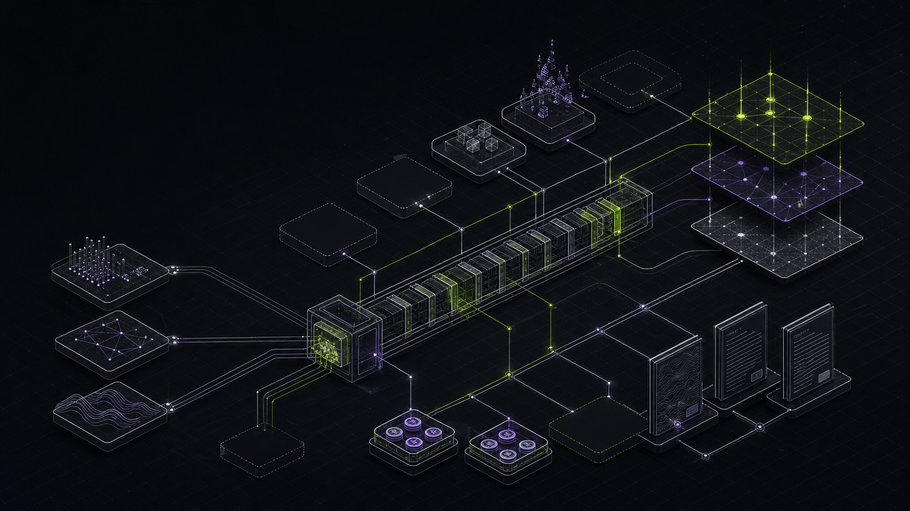

# 08 — Robinhood Chain tooling landscape

- Route: `#/tools/robinhood-chain`
- Related chain hub: `#/c/robinhood-chain`
- Evidence snapshot: 2026-08-29

## Landscape thesis

Robinhood Chain is live, EVM-compatible, and early. Its strongest verified surfaces are RPC/developer infrastructure, Chainlink data, bridges, custody, compliance, a public DEX, a proprietary liquidity/aggregation layer, lending, and early perpetuals. The page should make production integrations useful while preserving obvious gaps in launch, staking, broad yield, SocialFi, and collectibles.

The generated visual depicts one sequencer spine, layered finality rails, market modules, and empty sockets. It is conceptual; it must not be interpreted as an exact sequencer or bridge dependency graph.

## Category coverage

| Category | Coverage | Editorial note |
|---|---|---|
| Launch and issuance | announced | Uniswap Liquidity Launchpad design exists; no verified broad production launchpad |
| Spot DEX and liquidity | established | Uniswap public DEX plus Rialto proprietary liquidity |
| Aggregation, routing, and intents | established | Rialto and several cross-chain routers |
| Derivatives and prediction | emerging | Lighter and Arcus are documented ecosystem entries |
| Lending, borrowing, and stablecoins | emerging | Morpho and Paxos USDG provide initial rails |
| Yield, vaults, and strategy | emerging | Morpho vaults/lending supply; no broad native strategy ecosystem |
| Staking, restaking, and validation | native gap | an Arbitrum rollup has no user-facing native staking product equivalent to an L1 |
| Pricing, oracles, and market data | established | Chainlink feeds/streams plus market trackers |
| Analytics, indexing, and exploration | established | Blockscout, arbdata, Allium, and provider APIs |
| Charting, portfolio, and discovery | emerging | CoinGecko and Zerion integrations; pair-level native charting remains thin |
| Wallets, accounts, and custody | established | Robinhood Wallet, EVM wallets, Fireblocks, BitGo, ERC-4337 support |
| Bridges and interoperability | dense | canonical bridge and several fast/message/intent routes |
| MEV, order flow, and execution | emerging | sequencer feed and Rialto order flow; no documented open builder market |
| Security, risk, and compliance | established | TRM plus EVM simulation/audit ecosystem; native list is narrow |
| SocialFi, identity, and consumer | native gap | no qualifying production chain-native SocialFi tool in official landscape |
| Developer infrastructure | dense | Alchemy recommended plus several RPC providers and standard EVM frameworks |
| Collectibles and marketplaces | native gap | no qualifying production native marketplace in official landscape |

## Normalized inventory

| Tool | Categories | Scope | State | Surfaces | Placement evidence / integration note |
|---|---|---|---|---|---|
| [Uniswap Liquidity Launchpad](https://docs.uniswap.org/assets/files/whitepaper_cca-fc8b989c3a5b11f6fcd199f6c6837a77.pdf) | CT-01, CT-02 | Native design | announced | contracts/design | E1 — mechanism specification exists; no production classification without RHC deployed-address evidence |
| [Uniswap](https://developers.uniswap.org/docs/protocols/overview) | CT-02, CT-03 | Native | production | UI, SDK, contracts | E1 — Robinhood official ecosystem table identifies the public DEX; exact deployed version/address remains in details |
| [Rialto](https://docs.robinhood.com/chain/) | CT-02, CT-03, CT-13 | Native / service | production | UI-dependent, API, contracts | E1 — official RHC table identifies PropAMM and aggregator; public vs proprietary surfaces must be labeled |
| [Lighter](https://docs.lighter.xyz/) | CT-04 | Native | production | UI, API, SDK, contracts | E1 — perps entry in official RHC ecosystem table; verify RHC endpoint/deployment before integration |
| [Arcus](https://docs.robinhood.com/chain/) | CT-04 | Native | production | UI-dependent, API, contracts | E1 — official RHC table identifies perps integration; use official product link from data source when available |
| [Morpho](https://docs.morpho.org/developers/api/get-started/) | CT-05, CT-06, CT-16 | Native / cross-chain | production | UI, API, SDK, contracts | E1 — Morpho API explicitly lists Robinhood Chain ID 4663 |
| [Paxos USDG](https://docs.paxos.com/) | CT-05, CT-08 | Native asset / service | production | API, contracts | E1 — official RHC ecosystem table identifies USDG; reserve/issuer links required in details |
| [Chainlink Data Feeds](https://docs.chain.link/data-feeds) | CT-08 | Native / cross-chain | production | API, contracts | E1 — Robinhood Chain feed support appears in current Chainlink directory/changelog |
| [Chainlink Data Streams](https://docs.robinhood.com/chain/data-streams/) | CT-08, CT-13 | Native / service | production | API, SDK, contracts | E1 — RHC documents sub-second pull data and VerifierProxy integration |
| [CoinGecko](https://docs.coingecko.com/) | CT-08, CT-10 | Service | production | UI, API | E1 — official RHC ecosystem table identifies tracking support |
| [arbdata / Entropy Advisors](https://docs.robinhood.com/chain/) | CT-09 | Service | production | UI | E1 — official RHC ecosystem table identifies analytics dashboards |
| [Allium](https://docs.allium.so/) | CT-09, CT-08 | Service | production | API, SQL | E1 — official RHC ecosystem table identifies analytics support |
| [Blockscout](https://docs.blockscout.com/) | CT-09, CT-16 | Service / self-hostable | production | UI, API | E1 — official RHC connect page links the chain explorer |
| [Zerion](https://developers.zerion.io/) | CT-09, CT-10, CT-11 | Service / app | production | UI, API, wallet | E1 — official RHC ecosystem table identifies wallet-data support |
| [Robinhood Wallet](https://robinhood.com/us/en/support/articles/robinhood-wallet/) | CT-11 | App | production | UI | E1 — official RHC wallet guide identifies the first-party wallet |
| [MetaMask and EVM wallets](https://docs.robinhood.com/chain/add-network-to-wallet/) | CT-11 | App / service | production | UI | E1 — official add-network guide covers generic EVM-compatible wallets |
| [Fireblocks](https://developers.fireblocks.com/docs) | CT-11, CT-14 | Service | production | UI, API, SDK | E1 — custody provider listed in official RHC ecosystem table |
| [BitGo](https://developers.bitgo.com/) | CT-11, CT-14 | Service | production | UI, API, SDK | E1 — custody provider listed in official RHC ecosystem table |
| [Arbitrum canonical bridge](https://docs.arbitrum.io/launch-arbitrum-chain/how-tos/custom-gas-token/how-to-bridge-custom-gas-token) | CT-12 | Native rollup / Ethereum | production | UI, contracts | E1 — official RHC bridge guide identifies canonical bridge and withdrawal semantics |
| [LayerZero / Stargate](https://docs.layerzero.network/) | CT-12 | Cross-chain | production | UI, SDK, contracts | E1 — official RHC bridging guide lists LayerZero/Stargate |
| [Chainlink CCIP / Transporter](https://docs.chain.link/ccip) | CT-12 | Cross-chain | production | UI, SDK, contracts | E1 — official RHC bridging guide lists CCIP/Transporter |
| [Relay](https://docs.relay.link/) | CT-12, CT-03 | Cross-chain service | production | UI, API, SDK | E1 — official RHC bridging guide lists Relay |
| [Across](https://docs.across.to/) | CT-12, CT-03 | Cross-chain | production | UI, API, SDK, contracts | E1 — official RHC bridging guide lists Across |
| [LI.FI](https://docs.li.fi/) | CT-12, CT-03 | Cross-chain service | production | UI, API, SDK, contracts | E1 — official RHC bridging guide lists LI.FI |
| [0x](https://0x.org/docs/) | CT-12, CT-03 | Cross-chain service | production | API, SDK, contracts | E1 — official RHC bridging guide lists 0x; exact route/product shown in details |
| [Sequencer feed](https://docs.robinhood.com/chain/connecting/) | CT-13, CT-16 | Native | production | WebSocket/feed | E1 — official connect page publishes sequencer-feed endpoint; it is a wake-up/data surface, not a finality oracle |
| [TRM Labs](https://www.trmlabs.com/trm-products/transaction-monitoring) | CT-14 | Service | production | UI, API | E1 — compliance provider listed in official RHC ecosystem table |
| [Alchemy](https://www.alchemy.com/docs/chains/robinhood/robinhood-api-endpoints) | CT-16, CT-11 | Service | production | RPC, API, SDK | E1 — official RHC docs mark Alchemy recommended for RPC/account abstraction |
| [QuickNode](https://www.quicknode.com/docs/robinhood-chain) | CT-16 | Service | production | RPC, API | E1 — RPC provider listed by official RHC connect page |
| [Blockdaemon](https://docs.blockdaemon.com/) | CT-16 | Service | production | RPC, API | E1 — RPC provider listed by official RHC connect page |
| [dRPC](https://drpc.org/docs) | CT-16 | Service | production | RPC, API | E1 — RPC provider listed by official RHC connect page |
| [Validation Cloud](https://docs.validationcloud.io/) | CT-16 | Service | production | RPC, API | E1 — RPC provider listed by official RHC connect page |
| [Foundry](https://getfoundry.sh/) | CT-16 | Developer | production | CLI, framework | E1 — standard EVM framework supported by official RHC developer guides |
| [Hardhat](https://hardhat.org/docs) | CT-16 | Developer | production | CLI, framework | E1 — standard EVM framework supported by official RHC developer guides |
| [ethers](https://docs.ethers.org/) | CT-16 | Developer | production | SDK | E1 — EVM client library in official RHC development guidance |
| [viem / wagmi](https://viem.sh/docs/introduction) | CT-16 | Developer | production | SDK | E1 — typed client and app integration stack in official RHC development guidance |
| [ERC-4337 account abstraction](https://docs.erc4337.io/) | CT-11, CT-16 | Native standard / service | production | SDK, contracts, API | E1 — official RHC material documents AA support; provider/bundler remains explicit |

## Native gaps and category traps

- A live chain is not a mature ecosystem. Do not turn official partner listings into inferred depth for launch, SocialFi, collectibles, or yield.
- The rollup has at least three clocks: soft/sequencer observation, L1 posting, and L1 finality. Bridge withdrawal is a fourth user-facing duration. One “finality” badge is misleading.
- A sequencer feed indicates ordering/head progress; it is not proof of Ethereum posting or finality.
- Rialto’s PropAMM/aggregation surface and Uniswap’s public DEX are different access and liquidity models.
- Stock tokens and USDG require issuer, eligibility, transfer, jurisdiction, oracle, and redemption context beyond an ERC-20 symbol.
- Cross-chain providers may use different underlying routes. The table should reveal the selected route rather than displaying only the aggregator brand.
- No native staking card: Arbitrum rollup operation and Ethereum security are not a retail staking product.

## Primary research anchors

- [Robinhood Chain official documentation and ecosystem table](https://docs.robinhood.com/chain/)
- [Connect to Robinhood Chain](https://docs.robinhood.com/chain/connecting/)
- [Robinhood Chain bridging](https://docs.robinhood.com/chain/bridging/)
- [Robinhood Chain Data Streams](https://docs.robinhood.com/chain/data-streams/)
- [Add Robinhood Chain to a wallet](https://docs.robinhood.com/chain/add-network-to-wallet/)
- [Morpho supported networks](https://docs.morpho.org/developers/api/get-started/)
- first-party product documentation linked in each row

## Page-specific acceptance criteria

- Production, testnet, and announced states are independently filterable.
- CT-01 defaults to one announced design, not a production launchpad count.
- CT-07, CT-15, and CT-17 visibly render native gaps.
- Latency details show `soft`, `L1 posted`, `L1 final`, and `bridge withdrawal` separately and never derive basis points from a visual window.
- RWA/stablecoin rows expose issuer and eligibility fields.
- Sequencer feed details explicitly say `not L1 finality evidence`.
- The visual caption explains open sockets as editorial evidence of an emerging ecosystem, not missing image content.
